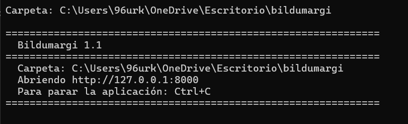
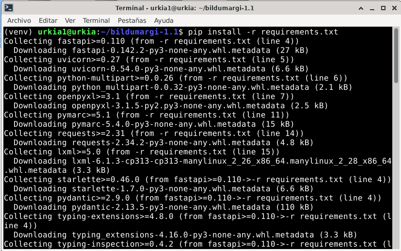
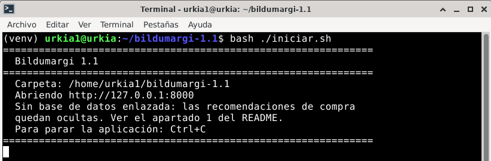

# Instalar en un ordenador

Con el zip, Bildumargi funciona en un ordenador con Windows, Linux o macOS,
sin instalarlo como servicio. Es la opción para una biblioteca que lo usa
sola o para probarlo. Para dar servicio a toda la red, ver
[Instalar en un servidor Linux](instalar-servidor.md).

Solo hace falta **Python 3.10 o superior**; el zip trae todo lo demás.

=== "Windows"

    **1. Instala Python.** Comprueba si ya lo tienes: abre el «Símbolo del
    sistema» y escribe

    ```
    python --version
    ```
  
    
    Si no responde con un número de versión, descárgalo de
    [python.org](https://www.python.org/downloads/) e instálalo marcando la
    casilla **«Add Python to PATH»**.

    **2. Descarga y descomprime Bildumargi.** Descarga `bildumargi-1.1.zip`
    de la [página de versiones](https://github.com/96urkia/bildumargi/releases)
    y descomprímelo (clic derecho → «Extraer todo») en una carpeta, por
    ejemplo `C:\Bildumargi`.

    **3. Instala las librerías (solo la primera vez).** En el Símbolo del
    sistema, entra en la carpeta y ejecuta:

    ```
    cd C:\Bildumargi\bildumargi-1.1
    pip install -r requirements.txt
    ```

    **4. Arranca.** Doble clic en **`iniciar.bat`**. Se abre una ventana con
    la dirección de Bildumargi y, a continuación, el navegador en
    `http://127.0.0.1:8000`.

    

    Para pararlo, cierra esa ventana o pulsa ++ctrl+c++ en ella.

=== "Linux"

    Debian, Ubuntu y otras distribuciones actuales no dejan instalar
    librerías de Python en el sistema con `pip` (sale el error
    *externally-managed-environment*). Por eso Bildumargi se instala en un
    **entorno virtual**: una carpeta con sus propias librerías, que no toca
    las del sistema.

    **1. Prepara el sistema (solo la primera vez):**

    ```
    sudo apt install -y python3-venv unzip
    ```

    **2. Descarga y descomprime Bildumargi** en tu carpeta personal:

    ```
    cd ~
    wget https://github.com/96urkia/bildumargi/releases/latest/download/bildumargi-1.1.zip
    unzip bildumargi-1.1.zip
    cd bildumargi-1.1
    ```

    **3. Crea el entorno virtual e instala las librerías (solo la primera
    vez):**

    ```
    python3 -m venv venv
    . venv/bin/activate
    pip install -r requirements.txt
    ```

    Al activar el entorno, la línea empieza por `(venv)`. `pip` descarga las
    librerías y termina con *«Successfully installed…»*:

    

    **4. Arranca:**

    ```
    bash iniciar.sh
    ```

    Se abre el navegador en `http://127.0.0.1:8000`:

    

    El aviso «Sin base de datos enlazada» es normal mientras no se conecte el
    [catálogo colectivo de la red](catalogo-red.md).

    Para pararlo, pulsa ++ctrl+c++ en la terminal. **Las siguientes veces**
    basta con:

    ```
    cd ~/bildumargi-1.1
    . venv/bin/activate
    bash iniciar.sh
    ```

=== "macOS"

    Instala Python 3 desde [python.org](https://www.python.org/downloads/)
    y sigue los pasos de Linux a partir del paso 2, en la aplicación
    Terminal. Para descargar el zip puedes usar el navegador en lugar de
    `wget`.

!!! info "Si también tienes el paquete .deb"
    La versión del zip usa el puerto **8000** y la del servicio `.deb`, el
    **8765**: pueden funcionar las dos a la vez en el mismo equipo. Para cambiar
    el puerto del zip, edita `PUERTO` en `config.py`.

## Siguiente paso

Rellena el [directorio de bibliotecas](directorio.md) con, al menos, tu
biblioteca: es el fichero `datos/bibliotecas.xlsx` de la carpeta de
Bildumargi.

## Actualizar

Descomprime la versión nueva en otra carpeta, copia en ella la carpeta
`datos/` de la anterior y vuelve a hacer el paso 3 (en Linux, con un entorno
virtual nuevo).
