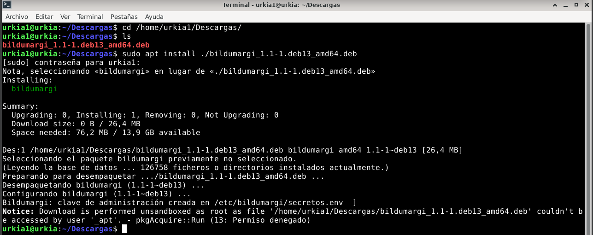
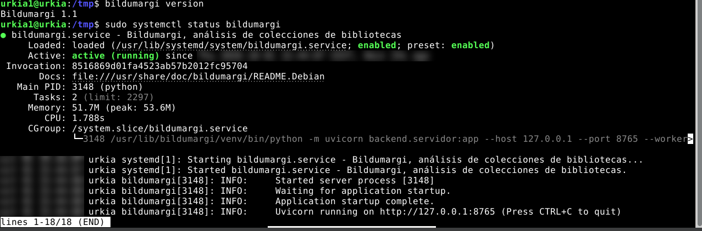
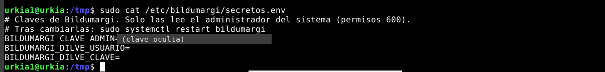
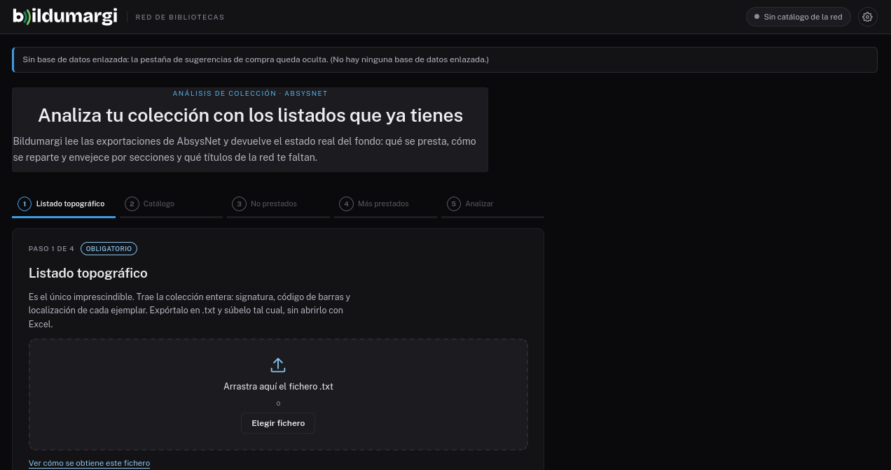
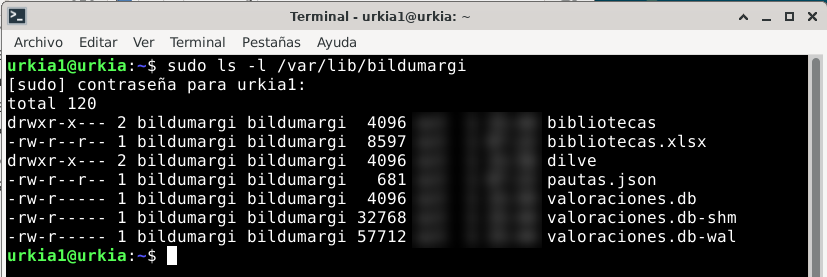
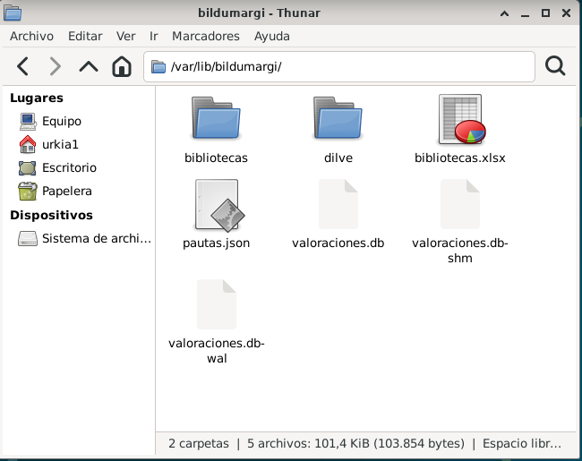

# Instalar en un servidor Linux

Para **Debian 12, Debian 13 y Ubuntu 24.04** hay un paquete `.deb` que
instala Bildumargi como un servicio más del sistema: arranca solo, se
actualiza con `apt` y guarda los datos aparte del programa.

Esta guía usa Debian 13. En las otras dos distribuciones los pasos son los
mismos; solo cambia el paquete.

## 1. Comprueba qué sistema tienes

Cada distribución tiene su propio paquete, porque cada una trae una versión
distinta de Python. Si instalas el de otra, `apt` se niega con un error como
*«Depende: python3.12 pero no es instalable»*.

```
cat /etc/os-release
```

| Si `PRETTY_NAME` dice… | Paquete que necesitas (termina en…) |
|---|---|
| Debian GNU/Linux 12 (bookworm) | `deb12_amd64.deb` |
| Debian GNU/Linux 13 (trixie) | `deb13_amd64.deb` |
| Ubuntu 24.04 LTS | `ubuntu24.04_amd64.deb` |

En los comandos de abajo, sustituye `deb13` por lo que te corresponda.

## 2. Descarga el paquete

Descárgalo en `/tmp`. Si lo descargas en tu carpeta personal también
funciona, pero `apt` muestra un aviso de «Permiso denegado» (ver el paso 3).

```
cd /tmp
URL=$(wget -qO- https://api.github.com/repos/96urkia/bildumargi/releases/latest | grep -o 'https://[^"]*deb13_amd64.deb')
echo $URL
wget "$URL"
wget https://github.com/96urkia/bildumargi/releases/latest/download/SHA256SUMS
```

La segunda línea pregunta a GitHub cuál es la última versión y guarda la
dirección del paquete; `echo` la muestra para comprobarla. También puedes
descargarlo desde el navegador, en la
[página de versiones](https://github.com/96urkia/bildumargi/releases).

Comprueba que el fichero ha llegado entero. Los dos códigos deben ser
iguales:

```
sha256sum bildumargi*deb13*.deb
grep deb13 SHA256SUMS
```

!!! info "Por qué el nombre lleva un punto"
    El paquete se llama, por ejemplo, `bildumargi_1.1-1.deb13_amd64.deb`.
    GitHub cambia la `~` del nombre original por un punto al publicarlo. Por
    eso los comandos usan comodines (`bildumargi*deb13*.deb`), que valen para
    cualquier versión.

## 3. Instala

```
sudo apt install ./bildumargi*deb13*.deb
```

`apt` instala Bildumargi y lo que necesita (Python y sus librerías), crea un
usuario propio para el servicio, genera una clave de administración y deja
Bildumargi arrancado.



Las líneas que importan son **«Configurando bildumargi»** y **«clave de
administración creada en /etc/bildumargi/secretos.env»**.

!!! note "El aviso «Notice: … Permiso denegado»"
    Sale si el paquete está en tu carpeta personal, como en la captura. `apt`
    descarga con un usuario restringido que no puede leer esa carpeta, así que
    lo hace como administrador y lo avisa. La instalación es correcta. Para
    que no salga, instala desde `/tmp`.

## 4. Comprueba que funciona

```
bildumargi version
sudo systemctl status bildumargi
```

Debe responder **Bildumargi 1.1** y mostrar **active (running)** en verde.
Pulsa ++q++ para salir.



La última línea indica dónde escucha: `http://127.0.0.1:8765`, es decir, solo
desde el propio servidor. Para abrirlo desde otros equipos, ver el paso 8.

## 5. Apunta la clave de administración

```
sudo cat /etc/bildumargi/secretos.env
```



La clave de administración sirve para entrar en
[Administración de la red](panel-red.md). Guárdala en un sitio seguro. Las
dos líneas de DILVE se rellenan en el paso 7.

## 6. Ábrelo

En el navegador del servidor, abre `http://127.0.0.1:8765`. Aparece el
asistente de carga:



El aviso de arriba («Sin base de datos enlazada») es normal mientras no se
conecte el [catálogo colectivo de la red](catalogo-red.md): el análisis de la
colección propia funciona igualmente.

## 7. Configura los datos de la red

### Dónde está cada cosa

| Qué | Dónde |
|---|---|
| El programa (no se modifica) | `/usr/lib/bildumargi` |
| Ajustes: dirección, puerto, carpeta de datos | `/etc/bildumargi/bildumargi.env` |
| Claves: administración y DILVE | `/etc/bildumargi/secretos.env` |
| Datos: directorio, valoraciones, historial, DILVE | `/var/lib/bildumargi` |
| Mensajes del programa | `journalctl -u bildumargi` |

La carpeta de datos pertenece al usuario del servicio y está protegida,
porque contiene las claves de las bibliotecas y las valoraciones de la red.
Para ver lo que hay dentro hace falta `sudo`:

```
sudo ls -l /var/lib/bildumargi
```



### El directorio de bibliotecas

El paquete trae una plantilla de `bibliotecas.xlsx` con tres filas de
ejemplo. Hay que sustituirla por el directorio de la red (ver
[Directorio de bibliotecas](directorio.md)). Hay dos formas de editarlo.

=== "Copiarlo, editarlo y devolverlo"

    ```
    sudo cp /var/lib/bildumargi/bibliotecas.xlsx ~/
    sudo chown $USER: ~/bibliotecas.xlsx
    ```

    Edítalo con LibreOffice Calc y guárdalo en formato Excel («Usar formato
    Excel 2007-365»). Después, devuélvelo:

    ```
    sudo cp ~/bibliotecas.xlsx /var/lib/bildumargi/
    sudo chown bildumargi:bildumargi /var/lib/bildumargi/bibliotecas.xlsx
    ```

=== "Darte permiso sobre la carpeta"

    Añade tu usuario al grupo del servicio y da permisos al grupo:

    ```
    sudo usermod -aG bildumargi $USER
    sudo chmod 2770 /var/lib/bildumargi
    sudo chmod 660 /var/lib/bildumargi/bibliotecas.xlsx
    ```

    Cierra la sesión y vuelve a entrar. Desde entonces puedes abrir la
    carpeta en el gestor de archivos y editar el Excel directamente:

    

    !!! warning
        Con este permiso, tu usuario puede ver y modificar **todos** los datos
        de Bildumargi. Solo debe tenerlo quien administre la red.

En los dos casos no hace falta reiniciar: Bildumargi relee el directorio en
cuanto cambia.

### Las credenciales de DILVE (opcional)

```
sudo nano /etc/bildumargi/secretos.env
```

Rellena las dos líneas, sin espacios alrededor del `=`:

```
BILDUMARGI_DILVE_USUARIO=vuestro_usuario
BILDUMARGI_DILVE_CLAVE=vuestra_contraseña
```

Guarda con ++ctrl+o++ y ++enter++, sal con ++ctrl+x++ y reinicia:

```
sudo systemctl restart bildumargi
```

Más detalles en [DILVE](dilve.md).

## 8. Publícalo en la red

Bildumargi escucha solo en el propio servidor. Para que lo usen las
bibliotecas, se publica detrás de **nginx**, que no se instala solo:

```
sudo apt install -y nginx
```

El paquete trae un ejemplo con HTTPS, que es lo recomendable en una red real:
`/usr/share/doc/bildumargi/ejemplos/nginx-bildumargi.conf`. Cópialo a
`/etc/nginx/sites-available/bildumargi`, pon el nombre del servidor y la ruta
del certificado, y actívalo:

```
sudo ln -s /etc/nginx/sites-available/bildumargi /etc/nginx/sites-enabled/
sudo rm -f /etc/nginx/sites-enabled/default
sudo nginx -t && sudo systemctl reload nginx
```

`nginx -t` debe responder *«syntax is ok»* y *«test is successful»*.

??? example "Configuración mínima sin certificado (solo para pruebas)"
    ```
    server {
        listen 80 default_server;
        server_name _;
        client_max_body_size 100M;
        proxy_read_timeout 600s;
        location / {
            proxy_pass http://127.0.0.1:8765;
            proxy_set_header Host $host;
            proxy_set_header X-Forwarded-For $proxy_add_x_forwarded_for;
            proxy_set_header X-Forwarded-Proto $scheme;
        }
    }
    ```


## Reiniciar y consultar el servicio

| Para | Orden |
|---|---|
| Ver si está en marcha | `sudo systemctl status bildumargi` |
| Reiniciarlo | `sudo systemctl restart bildumargi` |
| Ver sus mensajes | `journalctl -u bildumargi -n 50` |
| Ver la versión | `bildumargi version` |
| Generar la base del catálogo | `sudo bildumargi conversor fichero.mrc` |

**Hay que reiniciar** al cambiar `secretos.env` o `bildumargi.env`. **No hace
falta** al cambiar `bibliotecas.xlsx`. Bildumargi arranca solo con el sistema.

## Probarlo en una máquina virtual

??? tip "Instalación de prueba con VirtualBox"
    Para conocer el proceso antes de instalarlo en el servidor de la red:

    - Descarga Debian 13 (imagen *netinst*) y crea una máquina con 2 GB de
      RAM y 20 GB de disco. Marca «Omitir instalación desatendida».
    - En el instalador, **deja vacía la contraseña de root**: así el usuario
      que crees podrá usar `sudo`.
    - Con escritorio, puedes hacerlo todo dentro de la máquina, como en las
      capturas de esta página. Sin escritorio, como un servidor real, añade en
      VirtualBox *Red → Avanzado → Reenvío de puertos* las reglas
      `2222 → 22` (SSH) y `8080 → 80` (web). Después conéctate desde Windows
      con `ssh -p 2222 TU_USUARIO@localhost`, con el usuario que creaste al
      instalar.
    - Si la pantalla de la máquina es pequeña, la interfaz queda justa. Sube
      la resolución en Debian o instala las *Guest Additions* de VirtualBox.
