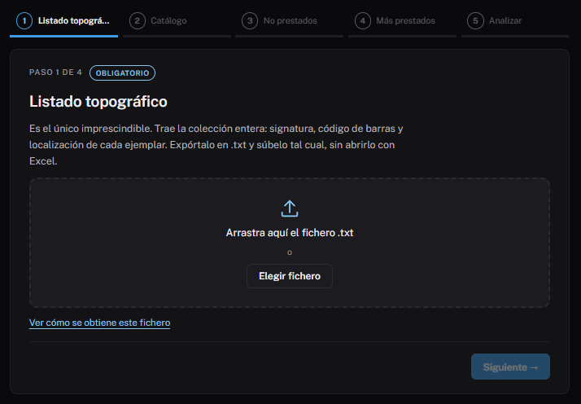
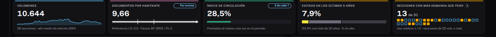

# Tu primer diagnóstico

En este recorrido harás el análisis completo de tu biblioteca, de la
exportación de AbsysNet al informe en PDF. Calcula unos **veinte minutos**.

**Necesitas:** acceso a AbsysNet y la dirección de Bildumargi que te haya
dado tu red (por ejemplo, `http://bildumargi.red.local`) o Bildumargi
instalado en tu ordenador.

## 1. Exporta los listados

En AbsysNet, exporta estos cuatro listados **en formato `.txt`**. Solo el
primero es imprescindible, pero con los cuatro el análisis es completo:

1. Listado topográfico de ejemplares.
2. Catálogo.
3. No prestados.
4. Más prestados.

Cómo obtener cada uno: [Exportar los listados de AbsysNet](../uso/exportar-absysnet.md).

!!! warning "No los abras con Excel"
    Guarda los ficheros tal cual salen. Si los abres y los guardas con Excel,
    se pierde el formato de columnas y Bildumargi no los reconocerá.

## 2. Abre Bildumargi y carga los ficheros

Abre la dirección de Bildumargi en el navegador. Verás el asistente de carga,
que pide un fichero por pantalla.

1. Arrastra el **listado topográfico** al recuadro, o pulsa **Elegir fichero**.
2. Pulsa **Siguiente** y repite con el catálogo, los no prestados y los más
   prestados. Si te falta alguno, pulsa **Omitir**.
3. En la última pantalla revisa el resumen y pulsa **Analizar colección**.

Bildumargi reconoce tu biblioteca por el código de sucursal de los listados:
no tienes que elegirla. Si te equivocas de paso al subir un fichero, lo
detecta por su contenido y lo coloca en su sitio.

## 3. Lee el diagnóstico

Al terminar se abre la pestaña **Diagnóstico**. Fíjate en tres cosas:

- **Los indicadores de arriba**: volúmenes, documentos por habitante frente a
  la referencia, índice de circulación y porcentaje editado en los últimos
  cinco años.
- **El gráfico de secciones**: cuánto pesa cada sección en el fondo y su
  **uso relativo**. Un 1,0 significa que rinde lo que pesa; por encima,
  rinde más; por debajo, menos. El «?» junto al dato lo explica.
- **La lectura automática**: un texto que resume lo más destacado.

Más detalle en [Diagnóstico](../uso/diagnostico.md).

## 4. Explora una sección

Abre la pestaña **Secciones** y pulsa un rectángulo del mapa (cuanto más
grande, más volúmenes; el color indica el uso). Verás sus años de edición,
sus localizaciones y la lista de ejemplares, que puedes descargar en CSV.

## 5. Imprime el informe

Pulsa **Informe**, junto a **Cambiar ficheros**. Se abre una vista previa en
hojas A4 con todo el análisis. Pulsa **Imprimir o guardar PDF** y elige
«Guardar como PDF» en el diálogo del navegador.

Este informe es útil para justificar el presupuesto ante el ayuntamiento:
explica cada dato y su fuente.

## Y ahora

- Si tu red tiene el catálogo colectivo conectado, mira
  [Sugerencias de compra](../uso/sugerencias-compra.md).
- Para no volver a subir los ficheros la próxima vez, pide una clave a tu red:
  [Entrar con clave](../uso/entrar-con-clave.md).
- Para ver la evolución de tu fondo, repite el análisis cada cierto tiempo y
  consulta [Seguimiento](../uso/seguimiento.md).
