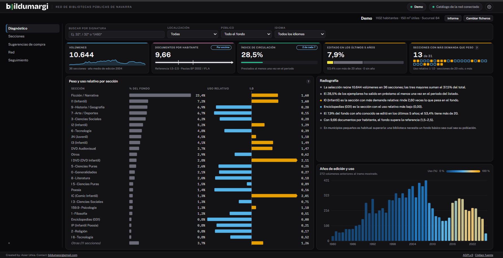

# Manual de Bildumargi

**Bildumargi** analiza la colección de una biblioteca pública a partir de los
listados que ya exporta AbsysNet. En unos minutos responde a tres preguntas:

- **¿Qué se usa y qué no?** Qué secciones rinden más de lo que pesan en el
  fondo y cuáles apenas se mueven.
- **¿Cómo está la colección?** Volúmenes, documentos por habitante, antigüedad
  y reparto por secciones, lenguas y localizaciones.
- **¿Qué conviene comprar?** Títulos que tienen otras bibliotecas de la red,
  otras obras de los autores más prestados y novedades editoriales ordenadas
  por el préstamo que se espera de ellas.

Es gratuito y libre (licencia AGPLv3), funciona sin conexión a internet y no
usa datos de lectores.

## Cómo usar este manual

El manual tiene dos partes, según quién lo lea:

-   **Personal bibliotecario**

    Empieza por [Tu primer diagnóstico](empezar/primer-diagnostico.md), un
    recorrido de veinte minutos. Después, [Uso diario](uso/index.md) explica
    cada pantalla.

-   **Jefaturas de servicio e informática**

    [Instalación y administración](administracion/index.md) explica cómo
    instalar Bildumargi, preparar el directorio de bibliotecas, conectar el
    catálogo de la red y DILVE, y gestionar la configuración común.

Si buscas un dato concreto, ve a [Referencia](referencia/indicadores.md). Si
quieres entender por qué Bildumargi calcula lo que calcula, a
[Cómo funciona](explicacion/uso-relativo.md).

!!! info "Versión"
    Este manual corresponde a **Bildumargi 1.1**. Las descargas están en la
    [página de versiones](https://github.com/96urkia/bildumargi/releases).
