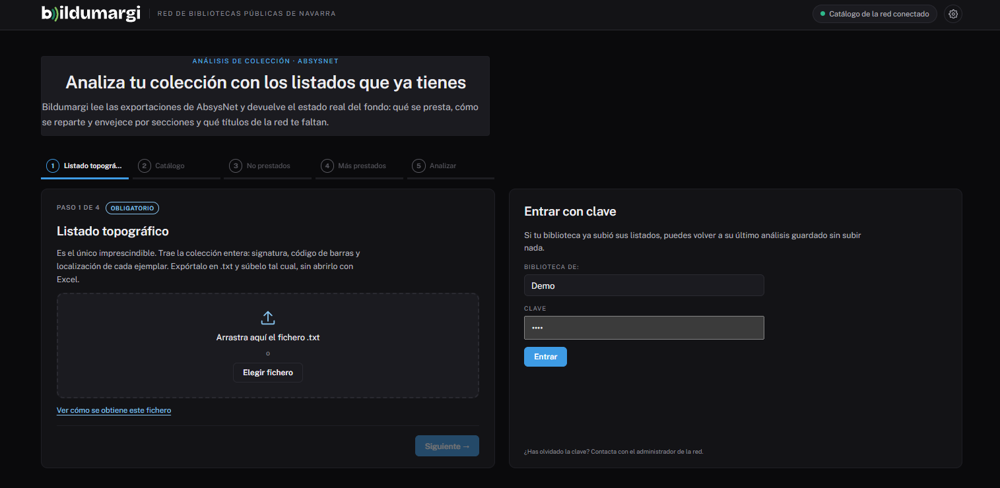

# Cargar los listados

La pantalla de inicio de Bildumargi es un **asistente** que pide un fichero
por paso.

## Paso a paso

1. **Topográfico.** Arrastra el fichero al recuadro o pulsa **Elegir
   fichero**. Es el único obligatorio.
2. **Catálogo.** Puedes elegir varios ficheros si lo exportaste por partes.
3. **No prestados.**
4. **Más prestados.**
5. **Resumen.** Revisa lo cargado y lo omitido. Puedes volver a cualquier paso
   pulsando en la barra de arriba.
6. Pulsa **Analizar colección**.

En los pasos opcionales, **Omitir** los salta. Cada paso explica qué aporta el
fichero y qué se pierde si no lo subes, y enlaza un vídeo que enseña a
obtenerlo.

## Qué hace Bildumargi al cargar

- **Reconoce tu biblioteca** por el código de sucursal (columna «Suc.» de los
  listados). Si el código no está en el directorio de la red, avisa: pide a tu
  red que lo añada.
- **Coloca cada fichero en su sitio** aunque lo hayas subido en otro paso.
- **Guarda la carga** si la red tiene activado el historial. Así podrás
  reabrirla desde [Seguimiento](seguimiento.md) o [entrar con clave](entrar-con-clave.md).

## Cambiar de ficheros

El botón **Cambiar ficheros**, arriba, vuelve al asistente para hacer un
análisis nuevo.
