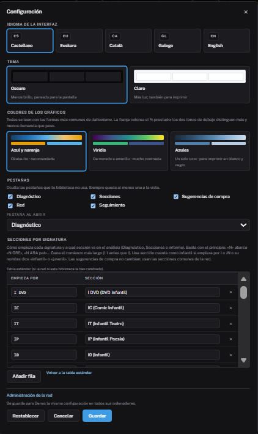

# Configuración de la biblioteca

El botón de la **rueda dentada**, arriba a la derecha, abre la configuración
de tu biblioteca. Se guarda en el servidor, así que es la misma en cualquier
ordenador desde el que entres.

## Opciones

- **Idioma**: castellano, euskera, catalán, gallego o inglés, según lo que
  ofrezca la red. Se traducen también los nombres de sección y el informe.
- **Tema**: oscuro o claro.
- **Colores de los gráficos**: tres paletas, todas legibles con las formas más
  comunes de daltonismo. «Azules» sirve para imprimir en blanco y negro.
- **Pestañas**: ocultar las que no uses y elegir con cuál se abre Bildumargi.
  Las que la red ha desactivado aparecen marcadas y no se pueden activar.

Los cambios de tema y colores se ven al momento. Si cierras sin guardar, se
deshacen.

## Secciones por signatura

Esta tabla dice a qué sección del análisis va cada signatura según **cómo
empieza**. Tiene dos columnas, **Empieza por** y **Sección**:

| Empieza por | Sección |
|---|---|
| `N` | Ficción / Narrativa |
| `I 1` | I 1 - Filosofía |
| `EUS` | Euskera |
| `VIA` | Viajes |

Por defecto trae la clasificación habitual. Puedes **añadir**, **cambiar** o
**quitar** filas:

- Basta con el principio: `N` abarca `N GRE cie`, `N ARA pat`…
- Gana el comienzo **más largo**: `I EUS` antes que `I`.
- Un prefijo con letras no se corta a mitad de palabra: `C` no se lleva
  `CUA 12`.
- Un prefijo numérico sigue la CDU: `8` incluye `821`.
- Una sección cuenta como **infantil** si empieza por `I` o `JN`, o si su
  nombre dice «infantil» o «juvenil».

Al guardar, el fondo se reclasifica al momento, sin volver a subir los
ficheros. Con **Volver a la tabla de la red** recuperas la tabla común.

!!! info "Solo afecta al análisis"
    La tabla cambia Diagnóstico, Secciones e Informe. Las sugerencias de
    compra siguen usando las secciones comunes de la red, que son las que se
    pueden cruzar con su oferta.
