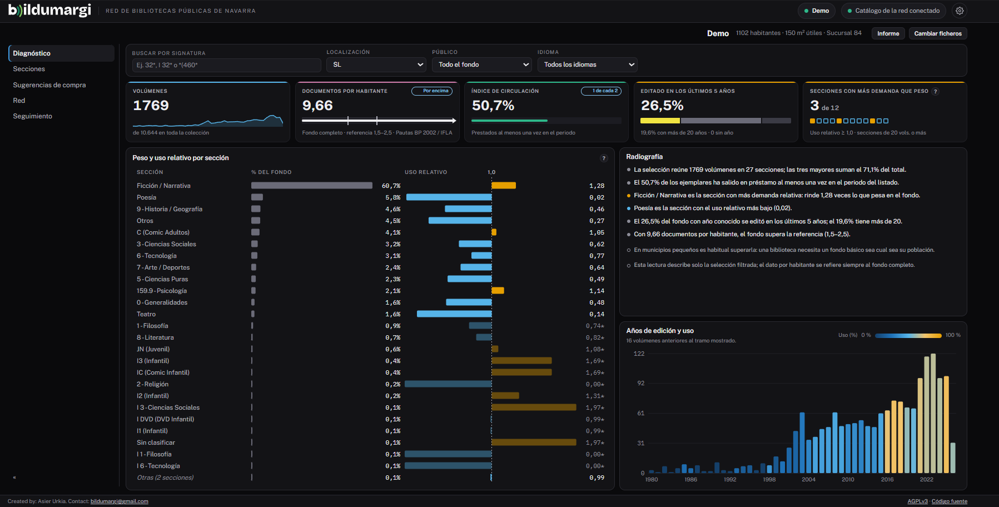

# Diagnóstico

La pestaña **Diagnóstico** es la radiografía del fondo en una sola pantalla.
Describe siempre la colección completa.

## Los indicadores de arriba

| Indicador | Qué mide |
|---|---|
| **Volúmenes** | Ejemplares del listado topográfico. |
| **Documentos por habitante** | Volúmenes entre la población atendida, comparados con la referencia de la red (por defecto, las Pautas de 2002: de 1,5 a 2,5). |
| **Índice de circulación** | Porcentaje de ejemplares que han salido en préstamo en el periodo de los listados. |
| **Editado en los últimos 5 años** | Peso de lo reciente en la colección. |
| **Año medio de edición** | Antigüedad media del fondo. |
| **Secciones distintas** | Número de secciones con fondo. |

Definiciones completas en [Indicadores](../referencia/indicadores.md).

!!! info "En municipios pequeños es normal superar la referencia"
    Una biblioteca necesita un fondo básico sea cual sea su población. La
    lectura automática lo tiene en cuenta y no lo marca como un problema.

## Peso y uso relativo por sección

El gráfico principal compara, para cada sección, **cuánto pesa** en el fondo
con **cuánto se presta**. El **uso relativo** resume esa comparación:

- **1,0**: la sección rinde lo que pesa.
- **Más de 1,0**: se presta más de lo que pesa. Suele indicar demanda que el
  fondo no cubre del todo.
- **Menos de 1,0**: se presta menos de lo que pesa. Puede indicar fondo
  envejecido o poco atractivo.

El «?» junto al dato lo explica, y [El uso relativo](../explicacion/uso-relativo.md)
lo desarrolla. Las secciones con muy pocos volúmenes llevan un asterisco: su
dato es solo orientativo.

## Filtrar el diagnóstico

La barra de arriba acota todo el panel:

- **Buscar por signatura**: con comodines, como en [Secciones](secciones.md#buscar-por-signatura).
- **Localización**: solo los ejemplares de una localización.
- **Público**: adultos, infantil o todo el fondo.
- **Idioma**: si la red tiene el catálogo colectivo conectado.

Los indicadores, el gráfico y la lectura automática se recalculan para la
selección. La lectura lo advierte: «Esta lectura describe solo la selección
filtrada».

!!! note
    El [informe imprimible](informe.md) describe siempre el fondo completo,
    sin estos filtros.

## La lectura automática

Debajo de los indicadores, un texto resume lo más destacado: secciones con más
demanda que peso, fondo envejecido, comparación con la referencia… Es un punto
de partida para el análisis, no una conclusión cerrada.

## Gráficos ampliables

Todos los gráficos tienen, arriba a la derecha, un cuadradito que aparece al
pasar el ratón y los abre en grande. En tamaño grande se pueden pulsar igual.
