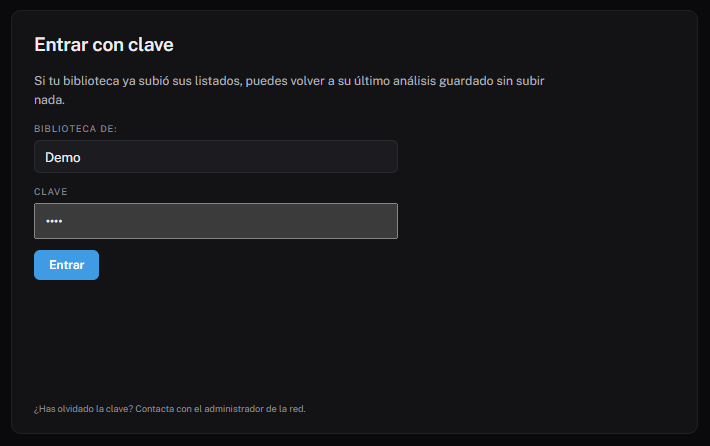

# Entrar con clave

Si tu fondo no ha cambiado desde el último análisis, no hace falta volver a
subir los listados. Con una clave abres directamente **tu última carga
guardada**.

## Cómo entrar

En la pantalla de inicio, a la derecha del asistente, está el panel **Entrar
con clave**:

1. En **Biblioteca de:** escribe el nombre de tu localidad, por ejemplo
   `Monteagudo`. No importan las tildes ni las mayúsculas.
2. En **Clave**, escribe la que te ha dado la administración de la red.
3. Pulsa **Entrar**.

Se abre el análisis como si acabaras de subir los ficheros, con un aviso de
la fecha de esa carga.

## Preguntas frecuentes

**No veo el panel.** La red no ha activado el acceso con clave, o no tiene el
historial de cargas activado. Pregunta a la administración.

**Dice «Tu biblioteca aún no tiene ninguna carga guardada».** Sube los
ficheros una vez con el asistente. A partir de ahí ya podrás entrar con la
clave.

**He olvidado la clave.** Pídela a la administración de la red: es quien las
crea y las cambia. No hay recuperación por correo.

**Dice «Demasiados intentos».** Tras cinco intentos fallidos hay que esperar
unos minutos.

!!! tip "Cuándo volver a subir los ficheros"
    Entra con clave para consultar. Cuando hayas hecho cambios en el fondo
    (altas, bajas, expurgo) o quieras actualizar el préstamo, vuelve a
    exportar y subir los listados.
