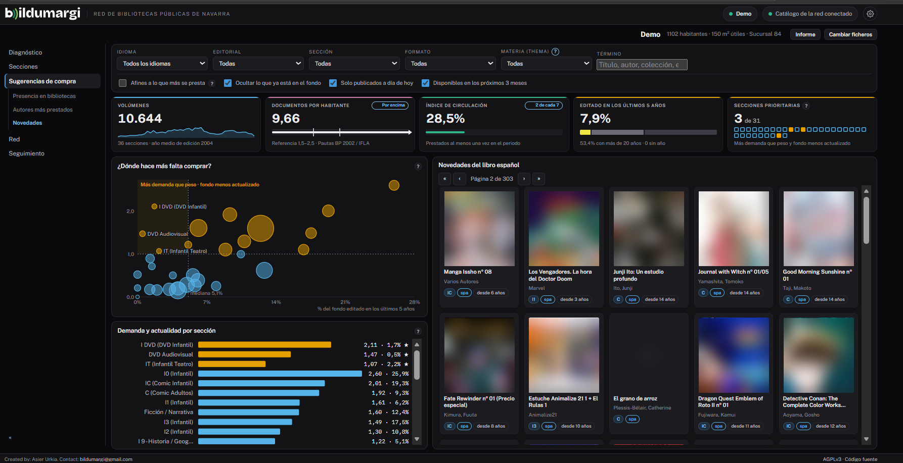
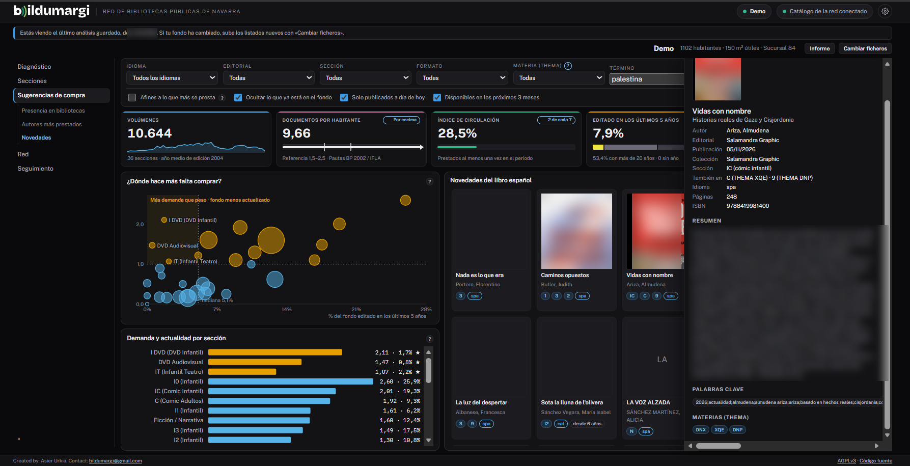
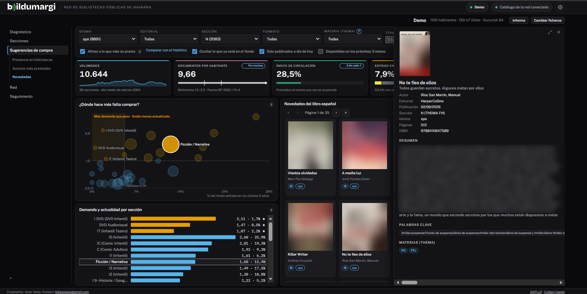

# Novedades de DILVE

**Novedades** muestra las altas recientes de DILVE, la base del libro en venta
en España, en una rejilla de portadas. Aparece si la red tiene acceso a DILVE.

## Filtros

- **Primera fila**: idioma, editorial, sección (la que le daría tu
  biblioteca), formato (rústica, tapa dura, libro de cartón, audiolibro…), materia
  Thema y el buscador.
- **Segunda fila**: las opciones de orden y de qué se ve.

El buscador busca en título, autor, colección, editorial, resumen y palabras
clave, con varias palabras en cualquier orden. También admite **códigos
Thema** en mayúsculas: `XQ` encuentra todos los géneros de cómic.

El filtro **Materia (Thema)** lista las materias presentes, en orden
alfabético y con su recuento. El «?» junto al rótulo abre el buscador oficial
de Thema.

Las casillas de la segunda fila:

- **Afines a lo que más se presta**: ordena por el préstamo que se espera de
  cada libro en tu biblioteca (ver abajo).
- **Ocultar lo que ya está en el fondo.**
- **Solo publicados a día de hoy** y **Disponibles en los próximos 3 meses**:
  activadas por defecto, muestran lo publicado más lo que sale en los
  próximos tres meses, sin preventas lejanas.

## «Afines a lo que más se presta»

Con esta casilla, las novedades se ordenan por el **préstamo esperado** en tu
biblioteca, calculado con tu propio historial. El autor y la serie pesan más
que la materia, porque es lo que mejor predice la demanda de un libro nuevo.
La lista se reparte entre secciones y no repite demasiado una misma serie o
autor.

El «?» junto a la casilla lo resume, y [El modelo de préstamo](../explicacion/modelo-prestamo.md)
lo explica a fondo.

### Comparar con el histórico

Con la casilla marcada aparece el enlace **Comparar con el histórico**. Hace
una prueba: con lo que tu biblioteca compró antes de un año, predice el
préstamo de lo que compró después, y compara el resultado con otros órdenes y
con el azar. Sirve para comprobar si el modelo acierta en tu biblioteca.

!!! tip "Cuantas más fichas, mejor"
    El modelo aprende de las fichas DILVE de tu propio fondo. Cada vez que se
    calcula «Autores más prestados» se descargan más. Si la comparación dice
    que hay pocos títulos de prueba, calcula «Autores más prestados» un par de
    veces y vuelve a probar.

## Un libro en varias secciones

Las editoriales suelen dar varias materias a un libro. Si una novela gráfica
es también novela romántica, aparece en las dos secciones y su ficha lo
indica como **También en**.
