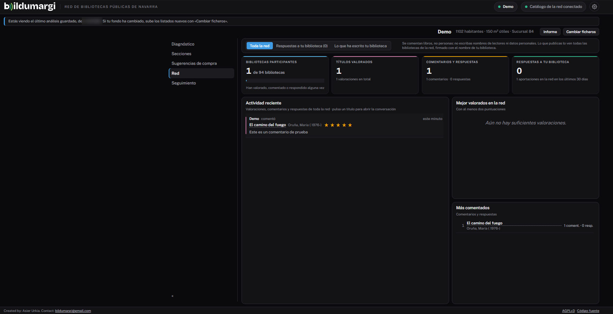

# Red y valoraciones

Las bibliotecas de la red pueden **puntuar** del 1 al 5 y **comentar**
cualquier título, y **responder** a los comentarios de las demás.

## Dónde se valora

Desde la ficha de un título, que se abre:

- en **Sugerencias de compra**, al pulsar un título que te falta;
- en **Secciones**, al pulsar un ejemplar de tu fondo;
- en la pestaña **Red**.

## La pestaña Red

Reúne la actividad reciente de toda la red, con filtros para ver solo las
respuestas a tus comentarios o solo lo que ha escrito tu biblioteca, los
títulos mejor valorados y los más comentados.

## Normas de uso

Se comentan **libros, no personas**. No escribas nombres de lectores ni datos
personales. Los comentarios se firman con el nombre de tu biblioteca, que
Bildumargi deduce de tus listados.

Cada biblioteca tiene una valoración por título, que puede editar o borrar.

!!! info "Solo en instalaciones centrales"
    Las valoraciones solo las ven las demás bibliotecas si Bildumargi está
    instalado en un servidor común de la red.
