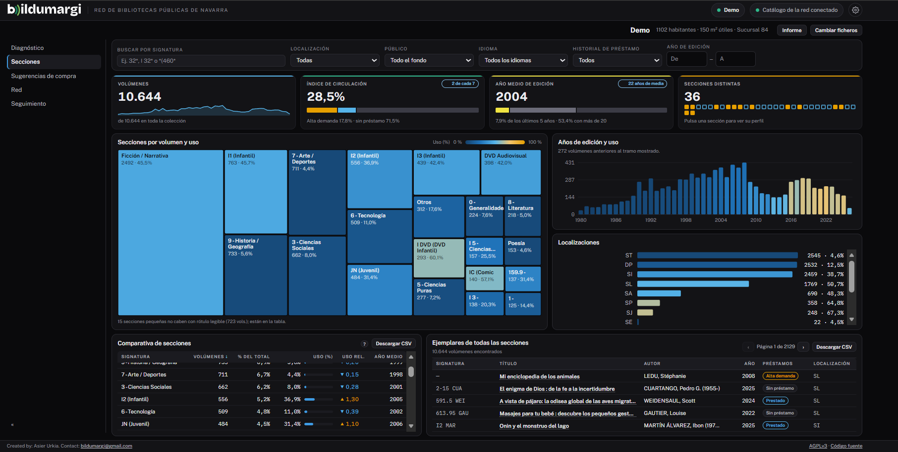
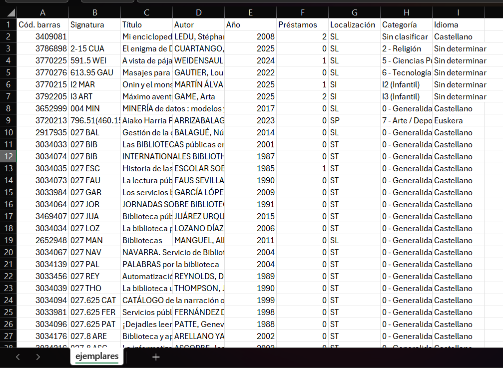
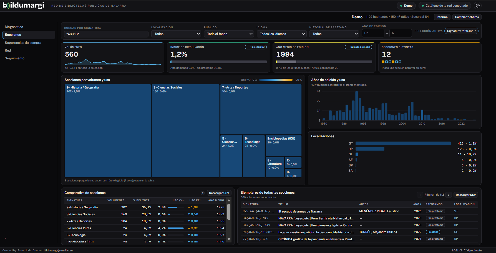
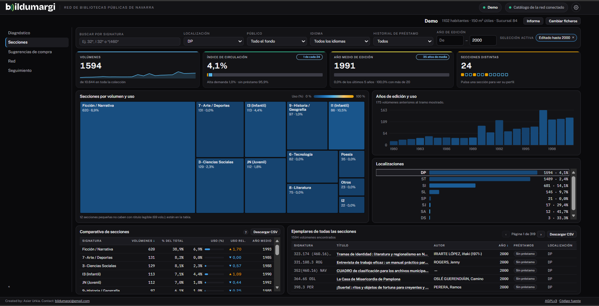

# Secciones

La pestaña **Secciones** sirve para explorar el fondo por signatura.

## El mapa de secciones

Cada rectángulo es una sección: **el tamaño** indica los volúmenes y **el
color**, el uso. Pulsa uno para seleccionar esa sección; el resto del panel
muestra su perfil:

- **Años de edición**: cuántos volúmenes hay de cada año.
- **Localizaciones**: dónde están los ejemplares.
- **Ejemplares**: la lista completa, con signatura, código de barras, título y
  préstamo, descargable en CSV.

El CSV se abre directamente en Excel o LibreOffice Calc:

## Buscar por signatura

El buscador admite comodines y varias signaturas separadas por comas:

- `32*` — todo lo que empieza por 32.
- `32*, I 32*` — la clase 32 de adultos e infantil.
- `*(460*` — todo lo que contiene «(460» (por ejemplo, España).

## Filtrar por año de edición

Los campos **De** y **A** acotan por año. Con los dos, es un intervalo; con
uno solo, «desde» o «hasta». Los ejemplares sin año se cuentan aparte y no
entran mientras el filtro esté activo.

## Valorar un ejemplar propio

Si tu fondo está enlazado con el catálogo de la red, al pulsar un ejemplar se
abre su ficha, donde puedes [valorarlo y comentarlo](red.md).

!!! tip "¿Las secciones no son las de tu biblioteca?"
    Si usas signaturas propias (por ejemplo, `VIA` para viajes o `EUS` para
    euskera), añádelas en la [tabla de secciones por signatura](configuracion.md#secciones-por-signatura).
