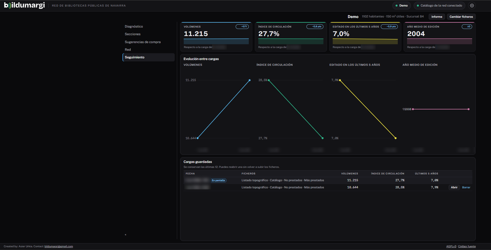

# Seguimiento

La pestaña **Seguimiento** aparece si la red guarda el historial de cargas.
Muestra cómo evoluciona tu fondo análisis a análisis.

## Qué muestra

- La evolución de **volúmenes**, **circulación**, **fondo de los últimos 5
  años** y **año medio de edición**, carga a carga.
- El cambio respecto a la carga anterior.
- La lista de cargas guardadas.

Las cargas sin listado de no prestados no tienen dato de circulación y no se
dibujan en esa serie.

## Reabrir o borrar una carga

Desde la lista puedes **reabrir** una carga anterior sin subir los ficheros, o
**borrarla**. La red decide cuántas se conservan (12 por defecto).

!!! tip "Para que la serie sea comparable"
    Exporta siempre los mismos listados, con el mismo periodo de préstamo, y
    repite el análisis con una frecuencia fija (por ejemplo, cada trimestre).
