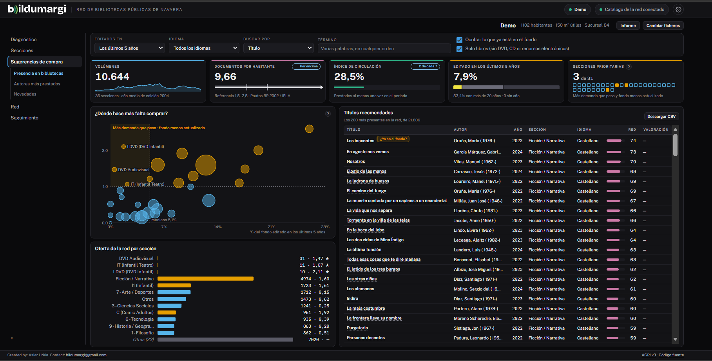
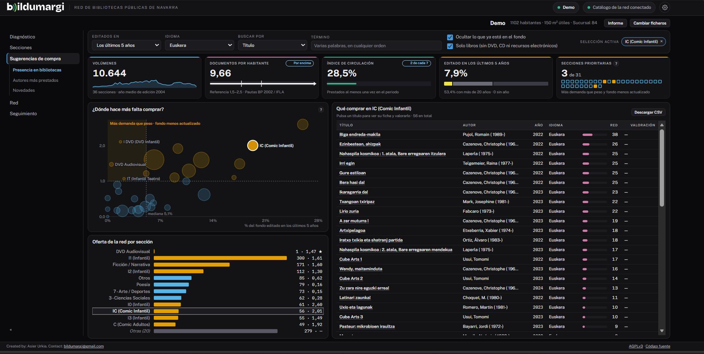
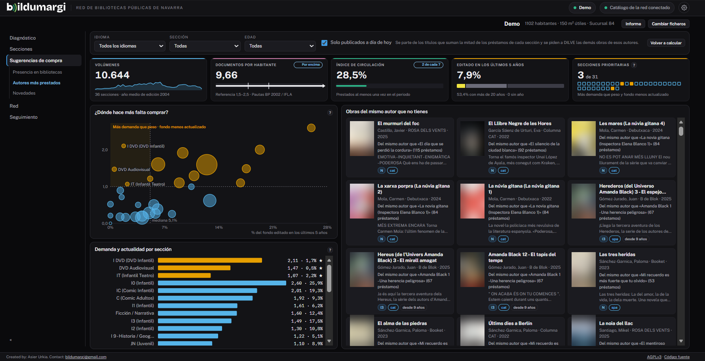
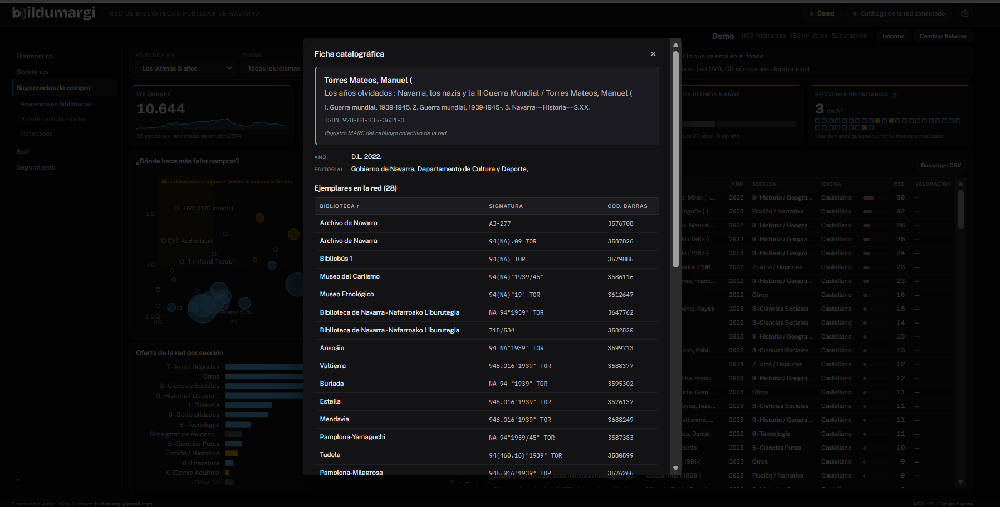

# Sugerencias de compra

La pestaña **Sugerencias de compra** aparece si la red tiene conectado el
catálogo colectivo. Cruza la demanda de tu fondo con lo que hay en la red y en
el mercado editorial.

## El panel de arriba: dónde comprar

Es igual en las tres fuentes:

- **Indicadores generales** del fondo.
- **¿Dónde hace más falta comprar?**: una matriz que cruza el **uso relativo**
  de cada sección con su **actualidad**. Las secciones prioritarias combinan
  más demanda que peso con un fondo menos actualizado.
- **Oferta de la red por sección.**

Al pulsar una sección, la lista de abajo se acota a ella.

## Tres fuentes de títulos

En el menú lateral eliges de dónde salen las sugerencias:

### Presencia en bibliotecas

Títulos que tienen muchas bibliotecas de la red y la tuya no, con su presencia
y sus valoraciones. Lo que ya está en tu fondo se descarta solo.

### Autores más prestados

Otras obras, a la venta, de los autores de tus títulos más prestados. Cada
propuesta dice de qué título sale. Tiene filtros de idioma, sección y edad.

La primera vez se calcula en segundo plano: verás un aviso de progreso. El
resultado se guarda y no se vuelve a calcular mientras tu préstamo no cambie;
para rehacerlo está **Recalcular**.

### Novedades

Las novedades editoriales de DILVE: ver [Novedades de DILVE](novedades.md).

## La ficha de un título

Al pulsar un título se abre su ficha a la derecha: portada, autoría,
editorial, fecha, colección, sección, idioma, resumen, palabras clave y
materias. Se puede ampliar con el botón de arriba o ensanchar arrastrando su
borde izquierdo.

En **Presencia en bibliotecas**, la ficha catalográfica muestra además qué
bibliotecas de la red tienen el título, con su signatura:

!!! info "Sin precios"
    Bildumargi no maneja precios ni presupuestos.
